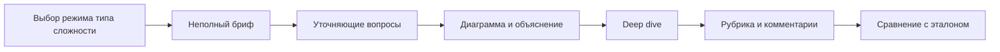

# System Design Trainer — контекст и требования

Источник правды по продукту. Решения ниже — принятые; пункты со статусом «дефолт» можно пересмотреть, пока нет реализации, которая на них завязана.

## 1. Зачем это существует

Подготовка к system design interview обычно выглядит так: читаешь главы, смотришь разборы «спроектируй Twitter», в лучшем случае рисуешь схему в одиночку. На собесесе другое: неполное условие, уточняющие вопросы, доска, давление по времени, deep dive в узкое место, trade-offs вслух.

Идея тренажёра — как пул паттернов в алгоритмах: **ограниченный набор типов архитектур**, которые реально спрашивают, и повторяемый навык прохождения формата интервью, а не энциклопедия всех систем мира.

Приложение локальное: человек готовится у себя, приносит свой ключ OpenRouter, ничего не уезжает в наш бэкенд (его нет).

## 2. Что это за продукт

Локальный десктопный тренажёр (Go-сервер на localhost + UI в браузере) для software engineers на рынке RU/СНГ.

Кандидат выбирает режим, тип архитектуры и сложность. LLM-агент ведёт себя как интервьюер: даёт бриф не целиком, отвечает на уточнения, смотрит схему, когда кандидат её «показывает», давит в deep dive. После сессии другой промпт того же провайдера заполняет рубрику. Эталонное решение — один валидный подход, не единственно верный; его видно в отдельном режиме после своей попытки.

Целевой пользователь — один человек за машиной, от тех, кто только начинает тренировать system design, до тех, кто наращивает глубину (senior/staff-уровень давления в той же оболочке).

## 3. Зафиксированные решения

- Продукт: локальный тренажёр system design interview.
- Стек v1: Go + HTMX, сервер на `127.0.0.1`, UI в обычном браузере. Без Wails/webview.
- LLM: агент с системным контекстом и задачей сессии; ключ пользователь приносит сам (OpenRouter).
- Язык: всё на русском (UI, промпты, банк задач, фидбэк).
- Сложность: градация 1–5, не «только middle».
- Режимы v1: полный mock; практика паттерна; только уточнение требований; сравнение с эталоном после попытки.
- Банк задач: текстовые файлы в ресурсах приложения; черновики генерируются LLM **на этапе разработки**, в репозиторий попадают после вычитки человеком. Рантайм не является единственным источником задач.
- Оценка: рубрика (чеклист критериев) + комментарии. Не голый балл и не только свободный текст.
- Хранение: полная история сессий на диске (чат, диаграмма, фидбэк) плюс настройки и ключ.

## 4. Как устроена сессия (продуктовая модель)

Сессия должна ощущаться как интервью, а не как викторина с правильным ответом.

Типичный полный mock:

1. Выбор режима, типа архитектуры и сложности (или конкретной задачи из каталога).
2. Интервьюер даёт **неполное** условие.
3. Кандидат задаёт уточняющие вопросы, финализирует требования и по возможности оценку нагрузки.
4. Рисует схему, объясняет текстом в чате.
5. Deep dive: bottlenecks, отказы, consistency, trade-offs.
6. Завершение → рубрика и комментарии.
7. Опционально — сравнение с эталоном.

Ориентир по времени полного mock (как на собесе, не жёсткий закон): уточнение требований и оценка нагрузки → high-level design и схема → deep dive → короткое wrap. Дефолтный таймер — 45 минут, можно выключить.

Эталон во время mock **интервьюер не видит**, чтобы не подталкивать к одной схеме. Оценщик и режим сравнения эталон видят и трактуют его как «один рабочий подход».

## 5. Режимы тренировки (v1)

### 5.1. Полный mock

Все фазы из раздела 4. Интервьюер ведёт диалог, кандидат рисует и объясняет, в конце — рубрика. Сравнение с эталоном — отдельный шаг после попытки, не часть речи интервьюера.

### 5.2. Практика паттерна

Кандидат выбирает семейство (лента, чат, хранение файлов и т.д.), а не конкретный бренд-продукт. Задача берётся из банка с этим тегом. Цель — набить руку на паттерне: fan-out, чанкинг загрузки, presence и т.п. Формат всё ещё интервьюшный (неполное ТЗ), но можно короче по времени и с более узким deep dive в «фирменное» узкое место типа.

### 5.3. Только уточнение требований

Стоп после финализации требований (и оценки нагрузки, если кандидат до неё дошёл). Схему можно не открывать. Оценщик смотрит только фазу discovery: какие вопросы задал, что зафиксировал, что забыл спросить, насколько осмысленно сузил scope.

### 5.4. Сравнение с эталоном

Доступен после своей попытки по той же задаче (полный mock или практика паттерна). Показывает эталонный нарратив, trade-offs и эталонную схему рядом с попыткой кандидата. Агент может провести разбор отличий, не объявляя любое отклонение ошибкой.

## 6. Сложность

Шкала 1–5 на карточке задачи. Это не грейд кандидата и не офер, а рычаг нагрузки:

- 1–2: узкий scope, мало скрытых NFR, подсказки интервьюера мягче, deep dive короче (шортенер, rate limiter, простой кэш).
- 3: типичный 45-минутный middle (чат, лента, уведомления).
- 4–5: больше скрытых ограничений, конфликтных NFR, легаси-набросок на доске, жёстче давление на отказы и эволюцию системы.

Новичок начинает с 1–2 и наращивает обороты. Фильтры каталога — по сложности и по типу архитектуры.

## 7. Типы архитектур (пул)

Каталог типов — отдельная сущность, не случайные названия продуктов. Задача принадлежит одному или нескольким типам. Режим практики паттерна выбирает тип, затем задачу из этого множества.

Стартовый пул (можно расширять файлами, не кодом):

- Шортенер / генерация ID
- Rate limiting / защита API
- Лента / fan-out
- Мессенджер / чат
- Хранение файлов и CDN
- Поиск
- Уведомления
- Загрузка и обработка видео / стриминг
- Гео / матчинг (nearby, заказы)
- Очереди и отложенные задачи
- Коллаборативное редактирование
- Платежи / идемпотентность / деньги
- Сбор метрик / аналитика событий
- Краулер / пайплайн данных

Тип в банке — стабильный id латиницей (`feed`, `chat`, `object_storage`, …) плюс русское имя для UI.

## 8. Банк задач

### 8.1. Откуда задачи

Источник правды — текстовые файлы в ресурсах приложения, например `internal/tasks/data/*.yaml`. Схемы к задачам — рядом, например `internal/tasks/data/diagrams/<task-id>.drawio`.

Черновики допустимо генерировать LLM в процессе разработки. В репозиторий попадает только вычитанный человеком файл. В рантайме v1 задача не переписывается моделью (см. открытые пункты).

### 8.2. Формат карточки

Один файл — одна задача. YAML, не markdown: проще парсить в Go и держать скрытые поля отдельно от публичного брифа.

Поля:

- `id` — стабильный идентификатор (`twitter-feed-v1`)
- `title` — русское название
- `difficulty` — 1–5
- `architecture_types` — список id типов
- `duration_min` — рекомендуемая длительность
- `canvas` — `blank` или `sketch`
- `starter_diagram` — путь к `.drawio`, если `canvas: sketch`
- `prompt_public` — первая реплика интервьюера, заведомо неполная
- `hidden.functional` — полный список функциональных требований
- `hidden.nonfunctional` — NFR, которые интервьюер знает, но не вываливает сразу
- `hidden.scale` — цифры нагрузки (DAU, QPS, размер объектов и т.д.)
- `reveal_on_question` — правила: какой класс вопроса раскрывает какой факт (чтобы агент не импровизировал цифры вразрез с карточкой)
- `preferred_solution.narrative` — связный разбор эталона
- `preferred_solution.tradeoffs` — какие развилки и почему эталон выбрал так
- `preferred_solution.diagram` — путь к эталонной схеме
- `rubric_overrides` — опционально; иначе общая рубрика из раздела 10

Интервьюеру в контекст: `prompt_public`, `hidden.*`, `reveal_on_question`, запрет сливать эталон. Эталон в этот промпт не кладётся.

Оценщику и режиму сравнения: всё выше плюс `preferred_solution` и транскрипт сессии.

### 8.3. Пустая доска и набросок

На классическом собесе чаще чистая доска: «спроектируйте ленту». Стартовый набросок тоже бывает: «вот текущая система, добавьте X» — чаще на senior/staff, при эволюции легаси, на внутренних петлях. Банк обязан содержать оба варианта через `canvas`.

Набросок — часть условия, не подсказка эталона. Эталонная схема — отдельный файл.

## 9. Диаграммы

### 9.1. Зачем схема в тренажёре

На интервью схема — основной артефакт, не иллюстрация к чату. Кандидат должен тренировать рисование и объяснение, а агент — иметь возможность разобрать решение, а не картинку «как есть».

### 9.2. Что рассматривали

- **Mermaid как редактор.** LLM читает идеально, в HTMX встраивается быстро. На собесе mermaid не пишут — плохая мышечная память.
- **Ручной экспорт с diagrams.net.** Нет встраиваемого фронта. Легко забыть вложить схему. PNG без vision бесполезен. Сырой XML шумный для модели.
- **Excalidraw.** Де-факто whiteboard удалённых собесов, JSON с подписями, MIT. Это React-остров и ломает «просто Go+HTMX».
- **iframe draw.io / diagrams.net.** Официальный embed: `embed=1&proto=json`, обмен через `postMessage`. Хост хранит XML, редактор только рисует. Для Go+HTMX это самый прямой встраиваемый путь: iframe и небольшой JS, без React. Статику редактора можно самохостить из [jgraph/drawio](https://github.com/jgraph/drawio), чтобы не зависеть от `embed.diagrams.net`. Сеть всё равно нужна для OpenRouter.

### 9.3. Решение v1

Встроенный draw.io через iframe. Предпочтительно самохостить статику редактора из бинаря/ресурсов Go, чтобы доска работала без чужого origin. Данные схемы хранит наше приложение, не сервер diagrams.net.

Fallback, если iframe не взлетел: загрузка `.drawio` / XML тем же каноническим парсером.

Несколько видов за сессию (контекст, контейнеры, deep dive) — как ревизии одной доски или отдельные листы в том же редакторе. История сессии хранит последнюю версию и ревизии, которые кандидат явно «показал» интервьюеру.

Vision и PNG в v1 нет.

### 9.4. Канонический текстовый слой

В LLM **не** отправлять сырой mxfile.

Перед отправкой сервер разбирает XML в топологию:

- узлы: id, подпись, тип (сервис, БД, очередь, кэш, клиент, внешняя система, прочее);
- рёбра: from, to, подпись (протокол / данные);
- короткий human-readable dump: `Клиент --HTTPS--> API Gateway --gRPC--> Feed Service`.

Этот слой — контракт между редактором и агентом. Если позже сменим редактор, UI и банк могут поменяться, промпт оценщика — нет.

### 9.5. Когда интервьюер видит доску

Не каждый штрих: дорого, шумно, не похоже на собес.

В UI кнопка вроде «Показать доску интервьюеру». По нажатию в сессию уходит каноническая проекция (и она же пишется в историю как ревизия). На завершении сессии оценщик получает последнюю проекцию, даже если кнопку не жали — иначе рубрика по HLD пустая.

## 10. Агент

Один провайдер — OpenRouter. Две роли, два системных промпта, одна или разные модели на выбор пользователя.

### 10.1. Интервьюер

- Говорит по-русски, как живой интервьюер, не как учебник.
- Начинает с `prompt_public`, не вываливает `hidden.*` списком.
- На уточняющий вопрос вызывает `reveal_facts` и отвечает **только на спрошенное**: даже если инструмент вернул всю корзину (`hidden.scale` / `functional` / `nonfunctional`), соседние факты не зачитывает.
- Если вопрос уместный, но в фактах карточки ответа нет — сам предлагает 1–2 разумных рабочих допущения, которые сужают ограничения архитектуры (география, клиенты, scope v1, согласованность, порядок величины если это меняет схему). Не выдаёт выдумку за факты карточки и не противоречит уже раскрытому. Кандидат может поправить. Когда кандидат сам назвал предположение — коротко оценивает, реалистично оно для такого сервиса или совсем мимо (если мимо — почему и попросить поправить порядок величины / scope).
- Не выдумывает противоречащие карточке цифры: нагрузка и скрытые требования только из `reveal_facts`. Рабочее допущение по оси, которой в фактах нет, — можно.
- Если кандидат не спрашивает важное — можно намекнуть позже, как на собесе, но не читать лекцию.
- Если кандидат не знает термин (спрашивает, что это значит, или просит объяснить проще) — коротко объяснить (1–2 предложения: что это и зачем здесь) и продолжить ту же фазу. Это не блокер упражнения. Определение — не факт карточки и не эталон: не вызывать `reveal_facts` на вопрос только про смысл, не подсовывать схему и стек под видом глоссы. На сложности 1–2 интервьюер может дать короткую глоссу в скобках, когда сам впервые вставляет плотный термин.
- Не знает и не сливает `preferred_solution`.
- Может попросить нарисовать, указать на часть схемы, углубиться в одно узкое место.
- Не ставит оценки сессии и не говорит «правильно/неправильно» про схему; sanity-check предположения по требованиям — можно.

### 10.2. Оценщик

Запускается по действию «Завершить сессию». Вход: транскрипт, финализированные требования (если кандидат их сформулировал), каноническая топология схемы, карточка задачи включая эталон, режим сессии.

Выход — рубрика, не эссе без структуры. По каждому критерию уровень `weak` / `ok` / `strong` и комментарий с опорой на цитаты из чата и на узлы/рёбра схемы.

Общая рубрика (критерии можно сужать режимом):

- Уточнение требований и scope
- Оценка нагрузки (если режим не requirements-only без цифр — всё равно отметить, спросил или нет)
- High-level design и полнота схемы
- Узкие места и масштабирование
- Отказоустойчивость и consistency
- Trade-offs (назвал развилку и цену выбора)
- Коммуникация (структура объяснения, работа с доской)

Вопрос «что значит термин» и опора на объяснение интервьюера — не слабость коммуникации и не минус к нагрузке или HLD: оценивать, смог ли кандидат дальше уточнить требования и спроектировать.

Temperature оценщика низкая. Интервьюер может быть свободнее.

### 10.3. Контекст и стоимость

В промпт идёт сжатая топология и релевантные куски карточки, не XML и не все ревизии подряд. В UI по возможности показывать расход токенов / оценку стоимости, если OpenRouter это отдаёт.

Ключ и id модели — в настройках. Дефолт: слот «дешёвая» модель для интервьюера и возможность указать «сильную» для оценщика; на старте может совпадать.

## 11. Данные и настройки

Один пользователь на машину, без аккаунтов.

Хранить локально:

- OpenRouter API key
- выбранные модели
- флаг и длительность таймера
- сессии: метаданные, транскрипт, ревизии схемы (XML + каноническая проекция), рубрика, связь с `task id`

Рекомендуемое хранилище сессий — SQLite в каталоге данных приложения (не в git). Ключ — отдельный файл с ограниченными правами (не коммитить; `.env` уже в `.gitignore`). Позже можно сменить на keyring, в v1 не обязательно.

Каталог задач и история открываются без сети. Чат с моделью — нет.

## 12. Функциональные требования (v1)

- **F1.** Локальный UI без регистрации и без облачного аккаунта продукта.
- **F2.** Настройки: ключ OpenRouter, модель(и), опциональный таймер (дефолт 45 минут, можно выключить).
- **F3.** Каталог задач: просмотр, фильтр по типу архитектуры и сложности, карточка с публичным описанием (без эталона и скрытых требований).
- **F4.** Старт сессии в одном из четырёх режимов (раздел 5).
- **F5.** Чат с интервьюером, стриминг ответа.
- **F6.** Встроенный редактор схемы (draw.io iframe), каноническая текстовая проекция, действие «Показать доску интервьюеру», fallback-загрузка `.drawio`/XML.
- **F7.** Завершение сессии → рубрика `weak`/`ok`/`strong` по критериям + комментарии.
- **F8.** После попытки — режим сравнения с эталоном (нарратив, trade-offs, схема, разбор отличий).
- **F9.** История: список сессий, повторное открытие чата, схемы и фидбэка.
- **F10.** Задачи с пустой доской и со стартовым наброском.
- **F11.** Оценка нагрузки живёт в чате, отдельной формы «заполни QPS» в v1 нет.
- **F12.** Показ расхода токенов/стоимости, если провайдер его отдаёт.

## 13. Нефункциональные требования

- **N1. Локальность.** HTTP-сервер слушает только `127.0.0.1`. Нет аккаунтов продукта, нет нашего бэкенда.
- **N2. Ключ.** API key уходит только на OpenRouter. Не логировать ключ, не класть в репозиторий, не отдавать в HTML целиком после сохранения (маска в UI).
- **N3. Офлайн.** Каталог и история работают без сети. Сессия с агентом требует сеть.
- **N4. Однопользовательский режим.** Нет разграничения учёток на одной машине.
- **N5. Данные.** Сессии на диске (SQLite). Переживание рестарта процесса и браузера.
- **N6. Нет телеметрии.** Не собираем usage сами.
- **N7. Предсказуемость оценки.** Оценщик — низкая temperature, структурированный вывод рубрики.
- **N8. Доска.** При самохосте редактора XML не должен уезжать на чужой бэкенд. CSP/iframe настроить так, чтобы postMessage ходил только к нашему origin и origin редактора.
- **N9. Запуск.** Один бинарь или `go run`. Docker не требование.
- **N10. Стоимость контекста.** В модель — каноническая топология и нужные поля карточки, не сырой XML и не весь банк.
- **N11. Язык.** UI и агент на русском.
- **N12. Безопасность bind.** Не слушать `0.0.0.0` по умолчанию: ключ и сессии не должны быть доступны из LAN.

## 14. Вне v1 (out of scope)

- Голос / аудиоинтервью
- Мультипользователь, шаринг сессий, облачный бэкенд, аккаунты
- Генерация банка только в рантайме как единственный источник задач
- Excalidraw / отдельный React-остров
- Нативное окно (Wails, webview)
- Английский UI и английский интервьюер
- Vision по PNG/скриншоту схемы
- Отдельный UML-режим (sequence как отдельный редактор); если кандидат рисует sequence в draw.io — это просто схема
- Публикация задач «в магазин», маркетплейс, синхронизация между машинами

## 15. Открытые пункты (дефолт, пока не решили иначе)

- **Таймер.** Опциональный, 45 минут, можно выключить.
- **Модели.** Выбор в настройках; дефолт — одна дешёвая, слот под сильную для оценщика.
- **Вариация формулировки в рантайме.** Нет в v1: текст файла как есть.
- **Голос.** Нет.
- **Когда слать схему.** По кнопке «Показать доску» и автоматически последнюю проекцию на завершении сессии.
- **Vision.** Нет в v1.
- **Оценка нагрузки.** В чате, не отдельная форма.
- **Самохост draw.io vs embed.diagrams.net.** Предпочтителен самохост; если упрёмся в размер/лицензирование статики — временный embed на `embed.diagrams.net` с тем же postMessage-протоколом, данные всё равно храним мы.
- **Файлы задач: YAML vs markdown+front matter.** YAML.
- **Хранилище сессий: SQLite vs папки.** SQLite.

## 16. Глоссарий

- **Тип архитектуры** — семейство задач с общим паттерном (лента, чат, object storage), не конкретный продукт.
- **Карточка задачи** — YAML в банке: публичный бриф, скрытые требования, эталон, рубрика.
- **Сессия** — один заход кандидата в выбранном режиме по одной задаче.
- **Интервьюер / оценщик** — две роли агента, не два продукта.
- **Эталон (`preferred_solution`)** — один валидный разбор, не единственно верная архитектура.
- **Каноническая проекция** — текстовая топология схемы для LLM (узлы, рёбра, dump).
- **Показать доску** — явное действие кандидата отдать текущую проекцию интервьюеру.
- **Рубрика** — набор критериев с уровнем `weak` / `ok` / `strong` и комментарием.

## 17. Принципы, чтобы не расползтись

- Тренируем формат собеса, не генератор «правильных» диаграмм.
- Неполнота брифа — фича. Полное ТЗ в первом сообщении — баг.
- Эталон не является ответом на экзамене и не должен утекать из интервьюера.
- Схема обязана быть читаемой моделью через проекцию, иначе фидбэк по HLD бессмыслен.
- Локальность и ключ пользователя важнее удобства «войти через Google».
- Сначала файловый банк и честный mock, потом любые умные вариации формулировок.
